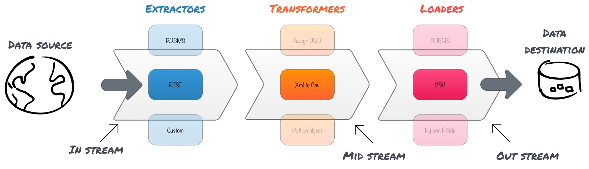

# ETL Pipeline

A simple linear Python 3 utility library that lets you pay attention to extraction, transformation and loading business logic and handles pipelining the processes for you.

All you need is to write callable classes for *extractor*, *transformers* and *loader* and configure your ETL pipeline passing them as input.

# Glossary
* **Streams**
Streams are channels that facilitates data flow in ETL pipeline. There are 3 streams:
  * instream - is the inlet to the pipeline, this takes data from source and passes it on to the next stream in pipeline.
  * outstream - is the outlet from the pipeline, this pushes data to the destination.
  * midstreams - are always between instream and outstream and they could repeat; one midstream can be followed by another. The data passes through midstreams in the pipeline so they can transform the data before it reaches the destination.
* **Extractor**
Extractor is reader abstraction in ETL process. The _instream_ in the pipeline needs an extractor to fetch data and pass along the next stream. It can be implemented as callable class that reads data from source and returns iterator for accessing the read data.
* **Transformer**
Transformer is, well, transformer abstraction in ETL process. The _midstreams_ in the pipeline need transformers to modify data/structure before passing it to next stream. Like extractor, transformer can be implemented as callable class that transforms the incoming data as needed and returns it.
* **Loader**
Loader is loader abstraction in ETL process. The _outstream_ in the pipeline needs a loader dump data on a destination storage. Loader too can be implemented as callable class that loads the incoming data to appropriate storage.
* **Pipeline**
Very much like Unix pipeline, a system of redirecting the output of streams to other streams.


## Examples
Following are simple examples to present the usage.

### REST API to CSV File

In this example a list of user records is fetched from [JSONPlaceholder fake REST API](https://jsonplaceholder.typicode.com/) and loaded into CSV file. Since it doesn't perform any data transformation I wont cover *Transformers* here.

First step is to initialise in-stream that fetches data from [JSONPlaceholder fake REST API](https://jsonplaceholder.typicode.com/).

_instream_ by itself cannot fetch data, it needs an extractor to do that. Extractors are callable classes that have the logic of reading data from source and handing it over to _instream_ in the form of an iterator.

Our source data is JSON list of users, etl-pipeline has a default extractor for reading JSON from REST API - HttpJSONExtractor, we will use that to initialise _instream_. Pass HttpJSONExtractor and provide parameters needed to initialize it.
```python
data_source_api = 'https://jsonplaceholder.typicode.com/users'
instream = pipe.instream(extractor=HttpJSONExtractor, extractor_config={'url': data_source_api})
```

That takes care of reading from source, now to store date to a CSV file, we will initialise the _outstream_.

Like _instream_, _outstream_ cannot load data by itself, it needs a loader to do that. Loaders are callable classes that have the logic of loading data into storage. _outstream_ provides loader with data, one record at a time.

etl-pipeline has a default loader for loading data in CSV file. To initialise _outstream_, we pass CSVLoader class and provide parameters needed to initialize it.
```python
filepath = "%s/'simple_transfer.csv'" % os.path.dirname(__file__)
headers = ['id', 'name', 'username', 'email', 'address', 'phone', 'website', 'company']
outstream = pipe.outstream(loader=CSVLoader, loader_config={'filepath': filepath, 'headers': headers})
```

Eventually we run the pipeline like so..
```python
pipe.flow(instream, outstream)
```
The data should be in CSV file by now!

Here's the full script..
```python
from etl import pipe
from etl.extractors import HttpJSONExtractor
from etl.loaders import CSVLoader
import os

data_source_api = 'https://jsonplaceholder.typicode.com/users'
instream = pipe.instream(extractor=HttpJSONExtractor, extractor_config={'url': data_source_api})

filepath = "%s/'simple_transfer.csv'" % os.path.dirname(__file__)
headers = ['id', 'name', 'username', 'email', 'address', 'phone', 'website', 'company']
outstream = pipe.outstream(loader=CSVLoader, loader_config={'filepath': filepath, 'headers': headers})

pipe.flow(instream, outstream)
```


### CSV File to MongoDB

The above example covers _instream_ with extractors and _outstream_ with loaders. This example will explain the role of transformers.

We read list of user records from local CSV file, transform csv records to JSON (Python dict) and load them into MongoDB collection.

Sample CSV:
```csv
id,first_name,last_name,email,gender,ip_address
1,Merla,Warin,mwarin0@nasa.gov,Female,255.185.60.174
2,Leonhard,Osbaldeston,losbaldeston1@ihg.com,Male,82.234.225.230
3,Dorie,Senten,dsenten2@eepurl.com,Female,251.2
```

We start by initialising _instream_, it will require a different extractor this time; CSVExtractor.


```python
source_filepath = "%s/csv_to_mongo_source.csv" % os.path.dirname(__file__)
instream = pipe.instream(extractor=CSVExtractor, extractor_config={'csv_file_path': source_filepath})
```
Our source is CSV format but MongoDB requires JSON, to handle this we will need a midstream that converts CSV record to JSON (essentially, Python dict). However, _midtream_ alone cannot transform data, it needs a transformer.

Let's initialise the midstream CSV to Dict transformer that comes with etl-pipeline.

```python
headers = ['id', 'first_name', 'last_name', 'email', 'gender', 'ip_address']
midstream = pipe.midstream(transformer=CsvToDictTransformer, transformer_config={'headers': headers})
```

Final prep step: initialise _outstream_ with MongoDB loader that comes with etl-pipeline.

```python
outstream = pipe.outstream(loader=MongodbLoader)
```
> **NOTE**
> I have used default config for extractors, transformers and loaders that come with etl-pipeline. You can take a look at them in their respective modules in etl package and play around with your own values.
>
> For example, MongodbLoader takes the following config parameters
>
>   - namespace
>   - uri
>   - db
>   - collection

We run the pipeline to move data from CSV file to MongoDB.
```python
pipe.flow(instream, outstream, midstream)
```


Here's the full script..
```python
from etl import pipe
from etl.extractors import CSVExtractor
from etl.transformers import CsvToDictTransformer
from etl.loaders import MongodbLoader
import os

source_filepath = "%s/csv_to_mongo_source.csv" % os.path.dirname(__file__)
instream = pipe.instream(extractor=CSVExtractor, extractor_config={'csv_file_path': source_filepath})

headers = ['id', 'first_name', 'last_name', 'email', 'gender', 'ip_address']
midstream = pipe.midstream(transformer=CsvToDictTransformer, transformer_config={'headers': headers})

outstream = pipe.outstream(loader=MongodbLoader)

pipe.flow(instream, outstream, midstream)
```

**Will add more examples soon!**

# Visual

